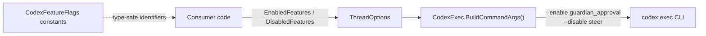

# Feature: Feature Flags

Links:
Architecture: [docs/Architecture/Overview.md](../Architecture/Overview.md)
Modules: [CodexSharpSDK/Models/CodexFeatureFlags.cs](../../CodexSharpSDK/Models/CodexFeatureFlags.cs), [CodexSharpSDK/Client/ThreadOptions.cs](../../CodexSharpSDK/Client/ThreadOptions.cs)
ADRs: [001-codex-cli-wrapper.md](../ADR/001-codex-cli-wrapper.md)

---

## Purpose

Expose Codex CLI feature flags through the SDK so consumers can enable or disable experimental and optional capabilities without relying on magic string literals.

---

## Scope

### In scope

- `CodexFeatureFlags` constants class mirroring the `features` block from `codex-rs/core/config.schema.json`
- `ThreadOptions.EnabledFeatures` / `ThreadOptions.DisabledFeatures` accepting these constants
- `CodexExecArgs.EnabledFeatures` / `CodexExecArgs.DisabledFeatures` for low-level exec control

### Out of scope

- Deciding which flags to enable at runtime (consumer responsibility)
- Feature flag semantics (controlled entirely by the Codex CLI)

---

## Business Rules

- Feature flag identifiers must match the Codex CLI's `config.schema.json` exactly; never invent new names.
- SDK ships constants for every known flag at the pinned submodule commit so consumers have compile-time safety.
- New flags added by upstream syncs must be added to `CodexFeatureFlags` in the same PR that updates the submodule.
- Raw string literals for feature flags are not permitted in SDK production code or tests; always use `CodexFeatureFlags` constants.

---

## Usage

```csharp
using ManagedCode.CodexSharpSDK.Models;

var thread = client.StartThread(new ThreadOptions
{
    // Enable guardian approval and request-permissions tool (added in upstream sync 06f82c1)
    EnabledFeatures = [
        CodexFeatureFlags.GuardianApproval,
        CodexFeatureFlags.RequestPermissionsTool,
    ],
    // Disable MCP elicitation
    DisabledFeatures = [
        CodexFeatureFlags.ToolCallMcpElicitation,
    ],
});
```

---

## Known Feature Flags

Sourced from `submodules/openai-codex/codex-rs/core/config.schema.json` at pinned commit.

### Approval / sandbox

| Constant | CLI string | Notes |
|---|---|---|
| `GuardianApproval` | `guardian_approval` | Guardian-based approval gate |
| `RequestPermissions` | `request_permissions` | Permission request flow |
| `RequestPermissionsTool` | `request_permissions_tool` | Request-permissions as a tool call |

### Execution

| Constant | CLI string |
|---|---|
| `UnifiedExec` | `unified_exec` |
| `ExperimentalUseUnifiedExecTool` | `experimental_use_unified_exec_tool` |
| `ShellTool` | `shell_tool` |
| `ShellSnapshot` | `shell_snapshot` |
| `ShellZshFork` | `shell_zsh_fork` |
| `UseLinuxSandboxBwrap` | `use_linux_sandbox_bwrap` |

### Apply patch

| Constant | CLI string |
|---|---|
| `ApplyPatchFreeform` | `apply_patch_freeform` |
| `ExperimentalUseFreeformApplyPatch` | `experimental_use_freeform_apply_patch` |
| `IncludeApplyPatchTool` | `include_apply_patch_tool` |

### MCP / tool calling

| Constant | CLI string | Notes |
|---|---|---|
| `ToolCallMcpElicitation` | `tool_call_mcp_elicitation` | MCP-style elicitation for tool approvals |

### Multi-agent / collaboration

| Constant | CLI string |
|---|---|
| `MultiAgent` | `multi_agent` |
| `Collab` | `collab` |
| `CollaborationModes` | `collaboration_modes` |
| `ChildAgentsMd` | `child_agents_md` |
| `Steer` | `steer` |

### Search

| Constant | CLI string |
|---|---|
| `SearchTool` | `search_tool` |
| `WebSearch` | `web_search` |
| `WebSearchCached` | `web_search_cached` |
| `WebSearchRequest` | `web_search_request` |

### Memory

| Constant | CLI string |
|---|---|
| `Memories` | `memories` |
| `MemoryTool` | `memory_tool` |

### Image

| Constant | CLI string |
|---|---|
| `ImageGeneration` | `image_generation` |
| `ImageDetailOriginal` | `image_detail_original` |

### Plugins / apps

| Constant | CLI string |
|---|---|
| `Plugins` | `plugins` |
| `Apps` | `apps` |
| `AppsMcpGateway` | `apps_mcp_gateway` |
| `Connectors` | `connectors` |

### JS REPL

| Constant | CLI string |
|---|---|
| `JsRepl` | `js_repl` |
| `JsReplToolsOnly` | `js_repl_tools_only` |

### Realtime

| Constant | CLI string |
|---|---|
| `RealtimeConversation` | `realtime_conversation` |
| `VoiceTranscription` | `voice_transcription` |

### Windows sandbox

| Constant | CLI string |
|---|---|
| `ExperimentalWindowsSandbox` | `experimental_windows_sandbox` |
| `EnableExperimentalWindowsSandbox` | `enable_experimental_windows_sandbox` |
| `ElevatedWindowsSandbox` | `elevated_windows_sandbox` |
| `PowershellUtf8` | `powershell_utf8` |

### Storage / DB

| Constant | CLI string |
|---|---|
| `Sqlite` | `sqlite` |
| `RemoteModels` | `remote_models` |

### Networking / transport

| Constant | CLI string |
|---|---|
| `ResponsesWebsockets` | `responses_websockets` |
| `ResponsesWebsocketsV2` | `responses_websockets_v2` |
| `EnableRequestCompression` | `enable_request_compression` |

### Miscellaneous

| Constant | CLI string |
|---|---|
| `FastMode` | `fast_mode` |
| `Artifact` | `artifact` |
| `RequestRule` | `request_rule` |
| `RuntimeMetrics` | `runtime_metrics` |
| `Undo` | `undo` |
| `Personality` | `personality` |
| `SkillEnvVarDependencyPrompt` | `skill_env_var_dependency_prompt` |
| `SkillMcpDependencyInstall` | `skill_mcp_dependency_install` |
| `CodexGitCommit` | `codex_git_commit` |
| `DefaultModeRequestUserInput` | `default_mode_request_user_input` |
| `PreventIdleSleep` | `prevent_idle_sleep` |

---

## Diagrams



---

## Upstream sync

Feature flags are kept in sync with the pinned `submodules/openai-codex` submodule.
When the submodule is updated, compare `codex-rs/core/config.schema.json` `.properties.features.properties` against `CodexFeatureFlags` and add any new entries.

Flags added by upstream sync `6638558b88 → 06f82c123c` (2026-03-08):
- `guardian_approval` — guardian approval MVP
- `request_permissions_tool` — request permissions as a tool call
- `tool_call_mcp_elicitation` — MCP-style elicitation for tool-call approvals

---

## Definition of Done

- `CodexFeatureFlags` constants match all `features` entries in pinned `config.schema.json`.
- Tests in `CodexExecTests` use `CodexFeatureFlags` constants (no raw string literals).
- Documentation table is complete and up to date.
