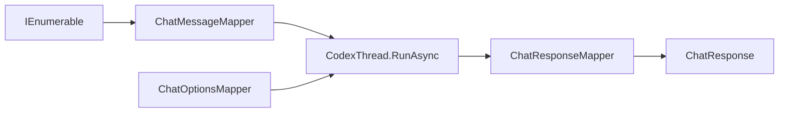

# Feature: Microsoft.Extensions.AI Integration

Links:
Architecture: [docs/Architecture/Overview.md](../Architecture/Overview.md)
Modules: [CodexChatClient.cs](../../CodexSharpSDK.Extensions.AI/CodexChatClient.cs)
ADRs: [003-microsoft-extensions-ai-integration.md](../ADR/003-microsoft-extensions-ai-integration.md)

---

## Purpose

Enable CodexSharpSDK to participate as a first-class provider in the `Microsoft.Extensions.AI` ecosystem by implementing `IChatClient`, unlocking DI registration, middleware pipelines, and provider-agnostic consumer code.

---

## Scope

### In scope

- `IChatClient` implementation (`CodexChatClient`) adapting `CodexClient`/`CodexThread`
- Input mapping: `ChatMessage[]` → Codex prompt + images
- Output mapping: `RunResult` → `ChatResponse` with `UsageDetails` and rich content
- Streaming: `ThreadEvent` → `ChatResponseUpdate` mapping
- Custom `AIContent` types for Codex-specific items (commands, file changes, MCP, web search, collab)
- DI registration via `AddCodexChatClient()` / `AddKeyedCodexChatClient()`
- Codex-specific options via `ChatOptions.AdditionalProperties` with `codex:*` prefix

### Out of scope

- `IEmbeddingGenerator` (Codex CLI is not an embedding service)
- `IImageGenerator` (Codex CLI is not an image generator)
- Consumer-side `AITool` registration (Codex manages tools internally)
- `Temperature`, `TopP`, `TopK` mapping (Codex uses `ModelReasoningEffort`)

---

## Business Rules

- `ChatOptions.ModelId` maps to `ThreadOptions.Model`.
- `ChatOptions.ConversationId` triggers thread resume via `ResumeThread(id)`.
- Multiple `ChatMessage` entries are concatenated into a single prompt while preserving original message chronology (Codex CLI is single-prompt-per-turn).
- `ChatOptions.Tools` is silently ignored; tool results surface as custom `AIContent` types.
- `GetService<ChatClientMetadata>()` returns provider name `"CodexCLI"` with default model from options.
- Streaming events map item-level, not token-level.
- Turn failures (`TurnFailedEvent`) propagate as `InvalidOperationException`.

---

## User Flows

### Primary flows

1. Basic chat completion
   - Actor: Consumer code using `IChatClient`
   - Trigger: `client.GetResponseAsync([new ChatMessage(ChatRole.User, "prompt")])`
   - Steps: map messages → create thread → RunAsync → map result
   - Result: `ChatResponse` with text, usage, thread ID as ConversationId

2. Streaming
   - Trigger: `client.GetStreamingResponseAsync(messages)`
   - Steps: map messages → create thread → RunStreamedAsync → stream events as ChatResponseUpdate
   - Result: `IAsyncEnumerable<ChatResponseUpdate>` with incremental content

3. Multi-turn resume
   - Trigger: `client.GetResponseAsync(messages, new ChatOptions { ConversationId = "thread-123" })`
   - Steps: resume thread with ID → RunAsync → map result
   - Result: Continuation in existing Codex conversation

---

## Repository Additions (baseline: `bc11f2f2a7d546f34155d88a4800095be840921a`)

### Projects added to solution

- `CodexSharpSDK.Extensions.AI/CodexSharpSDK.Extensions.AI.csproj`
  - `ManagedCode.CodexSharpSDK.Extensions.AI` package
  - `IChatClient` adapter (`CodexChatClient`) and DI extensions
- `CodexSharpSDK.Extensions.AI.Tests/CodexSharpSDK.Extensions.AI.Tests.csproj`
  - mapper/DI test coverage for M.E.AI integration

### Major artifacts introduced

- Adapter entry points: `CodexChatClient`, `CodexChatClientOptions`, `CodexServiceCollectionExtensions`
- Mapping layer: `ChatMessageMapper`, `ChatOptionsMapper`, `ChatResponseMapper`, `StreamingEventMapper`
- Rich content models: `CommandExecutionContent`, `FileChangeContent`, `McpToolCallContent`, `WebSearchContent`, `CollabToolCallContent`
- Docs: ADR `003` and this feature specification

---

## How to Obtain `IChatClient`

### Option 1: Direct construction

```csharp
using Microsoft.Extensions.AI;
using ManagedCode.CodexSharpSDK.Extensions.AI;
using ManagedCode.CodexSharpSDK.Models;

IChatClient client = new CodexChatClient(new CodexChatClientOptions
{
    DefaultModel = CodexModels.Gpt54,
});
```

### Option 2: Standard DI registration

```csharp
using Microsoft.Extensions.AI;
using Microsoft.Extensions.DependencyInjection;
using ManagedCode.CodexSharpSDK.Extensions.AI.Extensions;
using ManagedCode.CodexSharpSDK.Models;

var services = new ServiceCollection();
services.AddCodexChatClient(options =>
{
    options.DefaultModel = CodexModels.Gpt54;
});

using var provider = services.BuildServiceProvider();
var chatClient = provider.GetRequiredService<IChatClient>();
```

### Option 3: Keyed DI registration

```csharp
using Microsoft.Extensions.AI;
using Microsoft.Extensions.DependencyInjection;
using ManagedCode.CodexSharpSDK.Extensions.AI.Extensions;
using ManagedCode.CodexSharpSDK.Models;

var services = new ServiceCollection();
services.AddKeyedCodexChatClient("codex-main", options =>
{
    options.DefaultModel = CodexModels.Gpt54;
});

using var provider = services.BuildServiceProvider();
var keyedClient = provider.GetRequiredKeyedService<IChatClient>("codex-main");
```

---

## Diagrams



---

## Verification

### Test commands

- build: `dotnet build ManagedCode.CodexSharpSDK.slnx -c Release -warnaserror`
- test: `dotnet test --solution ManagedCode.CodexSharpSDK.slnx -c Release`
- format: `dotnet format ManagedCode.CodexSharpSDK.slnx`

### Test mapping

- Mapper tests: `CodexSharpSDK.Extensions.AI.Tests/ChatMessageMapperTests.cs`, `ChatOptionsMapperTests.cs`, `ChatResponseMapperTests.cs`, `StreamingEventMapperTests.cs`
- DI tests: `CodexSharpSDK.Extensions.AI.Tests/CodexServiceCollectionExtensionsTests.cs`

---

## Definition of Done

- `CodexChatClient` implements `IChatClient` with full mapper coverage.
- DI extensions register client correctly.
- All mapper and DI tests pass.
- ADR and feature docs created.
- Architecture overview updated.
